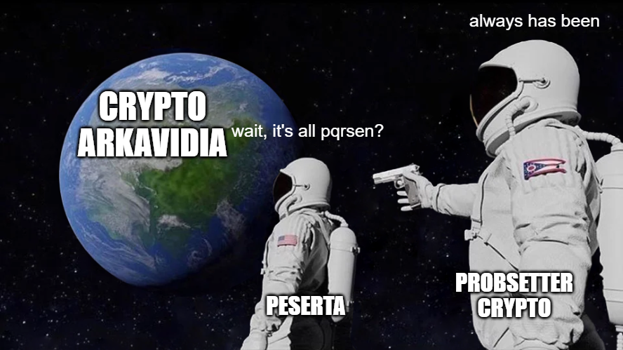

# qratz2048
## Description
Last year, pqrsen wasn't solved using the intended solution because I forgot to patch & put constraints to my challenge when doing some changes. So I create a cryptosystem based on it.

Hopefully, it's working this time! And don't even try to bruteforce 15 alphanumeric & case-sensitive chars!

Unrelated:

- Author: haverzard
- Note: Format flag `Arkav7{}`

## Flag
`Arkav7{weLL_pLaY3d_My_dUde!jUSt_d0n7_foRg3t_T0_PaTCh_y0uR_cHaLl3nGE_wHEN_Do1nG_s0Me_Ch4Nges_aNd_hoP3fuLly_7h1s_i5_THe_l457_t1ME_wE_wIlL_s3E_pqrsen}`